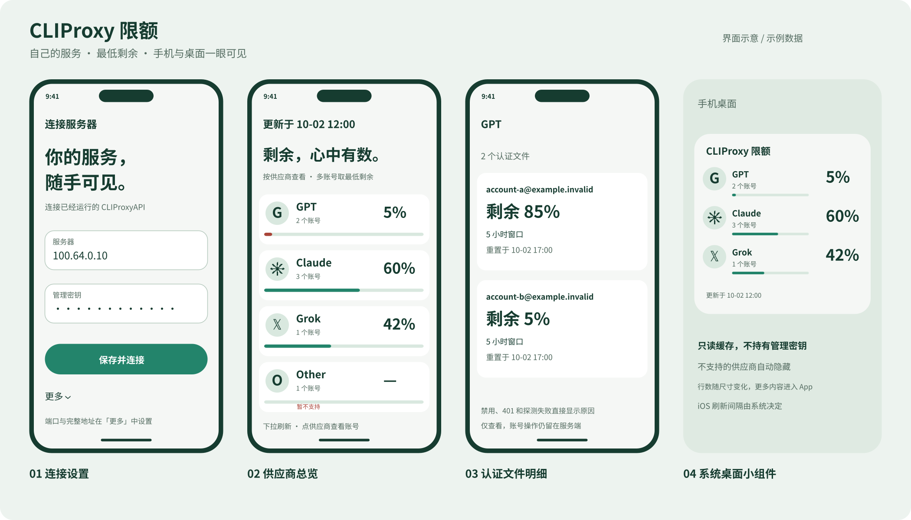
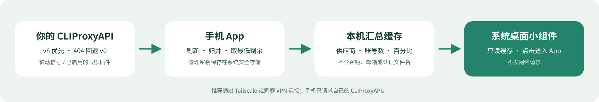

# CLIProxy 限额

[](https://github.com/wkddkw/cliproxy-quota/actions/workflows/ci.yml)

只读的 CLIProxyAPI 手机 App，支持 Android、iPhone 和系统桌面小组件。按供应商归并账号，显示最低剩余额度；点击供应商查看认证文件明细。



*界面示意，图中为示例数据；系统桌面小组件的布局和行数会随平台与尺寸变化。*

**[下载 Android 预览版](https://github.com/wkddkw/cliproxy-quota/releases/tag/v0.1.0) · [查看构建记录](https://github.com/wkddkw/cliproxy-quota/actions) · [接口适配说明](docs/api-contract.md)**

## 数据如何流动



## 使用

1. 在手机上安装 App，确认手机可以通过 Tailscale / 家庭 VPN 访问自己的 CLIProxyAPI。
2. 初次打开填写服务器 IP / 主机名和**管理密钥**（`secret-key` 或 `MANAGEMENT_PASSWORD`），点击「保存并连接」。默认地址为 `http://服务器:8317`。
3. 自定义端口或 HTTPS 域名在「更多」中填写。可粘贴包含 `/v8/management`、`/v0/management`、`/management.html` 的完整地址，App 会去掉这些后缀。
4. 总览下拉刷新，点击供应商查看邮箱 / 文件名、剩余、窗口、重置时间和不可用原因。
5. Android 长按桌面 → 小组件 → CLIProxy 限额；iPhone 长按桌面 → 添加小组件 → CLIProxy 限额。

小组件只读取本机缓存，点击后打开 App。iOS 系统控制刷新时间，通常至少 15 分钟；打开 App、返回 App 或下拉刷新可重新查询并请求更新小组件。系统实际展示仍可能延迟。

## 限额能力

- v8 优先，只有 404 才回退 v0；地址错误、管理密钥错误、远程访问被拒绝分别提示。
- 支持 Codex / Claude 被动限额信号，以及服务器实际启用的供应商限额插件（包括 Grok 插件）。解析真实 `groups → buckets → remainingFraction`，不会根据供应商名称假定额度。
- 5 小时窗口优先，没有时使用实际返回的主窗口。多个账号显示最低剩余，不取平均。
- 暂不支持的供应商在 App 标注「暂不支持」，小组件中隐藏。已支持但无数据 / 探测失败会显示具体原因，不伪造百分比。
- 部分账号不可用或无数据时，总览显示 `—` 并提示查看明细，已知账号的额度仍可在明细查看。

详细接口和边界说明见 [docs/api-contract.md](docs/api-contract.md)。

## 构建与下载

使用 **Flutter 3.47.6 stable**、Java 17；Android 7.0+，iOS 17.0+。

```sh
flutter pub get
flutter analyze
flutter test
flutter run
# 生成 Android APK
flutter build apk --release
# 在 macOS + Xcode 上构建 iOS
flutter build ios --release --no-codesign
```

[GitHub Actions](https://github.com/wkddkw/cliproxy-quota/actions) 会执行静态检查、测试、Android APK 构建和 iOS 未签名构建。成功的运行页面下方有 `cliproxy-quota-android` 下载包，解压得到 APK。当前 APK 使用开发签名，适合自行安装验证；上架或长期发行需配置自己的正式签名密钥。

iOS 未签名构建用于验证编译，**不能直接安装到 iPhone**。真机运行需在 Xcode 中：

1. 打开 `ios/Runner.xcworkspace`，为 Runner 和 QuotaWidget 选择自己的 Apple Developer Team。
2. 如果原标识不可用，修改两个 target 的 Bundle Identifier。
3. 为两个 target 启用同一个 App Group；默认是 `group.com.wkddkw.cliproxyQuota`。若修改它，同步替换两个 entitlements 及 `AppDelegate.swift`、`QuotaWidget.swift` 中的字符串。
4. 选择自己的 iPhone 并运行，或配置签名后 Archive / TestFlight。

WidgetKit 扩展 target 和嵌入配置已纳入 Xcode 工程，不需手动创建。`scripts/configure_ios_widget.rb` 是可重复运行的工程配置脚本。

## 数据与范围

管理密钥存于 Android Keystore 支持的加密存储 / iOS Keychain。地址与认证文件显示数据只保存在本机；小组件缓存只包含供应商汇总，不包含密钥、邮箱和文件名。没有分析 SDK、云端代理或凭证上传。默认 HTTP 适用于可信 VPN；HTTPS 可在「更多」设置。

所有网络请求只发到你配置的 CLIProxyAPI。插件限额由服务器查询供应商。App 不编辑配置、不上传或删除认证文件、不重新登录、不重置额度、不读取消费型 usage-queue。

「清除这台服务器」会移除本机地址、管理密钥和全部缓存，并清空小组件。
